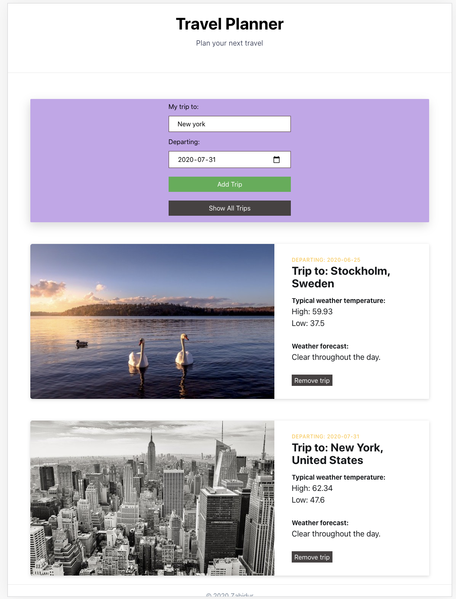

## Trip Planner

This is a full stack application which creates a RESTful API using Node and Express JS as backend and HTML, CSS, JS, Webpack as frontend. This application allows you to create your own Trip Planner.

### Prerequisites

- Install `node`
- Install `npm`
- Create and fill the .env file with API keys from Geonames, Darksky, and Pixabay like this:

```
GeonamesUsername=********************
darkSkyKEY=**************************
pixabayKEY=**************************
PORT = 8081
```

### How to run

- Clone this repo
- `cd` to the folder
- Run `npm install`

#### Production mode

- `npm run build-prod`
- `npm run start`

#### Development mode

- `npm run build-dev`
- `npm run server`

#### Test mode

- `npm run test`

## Built With

- HTML
- CSS
- JavaScript
- Webpack
- Sass
- Jest
- Babel
- Express
- Geonames, Darksky, and Pixabay


